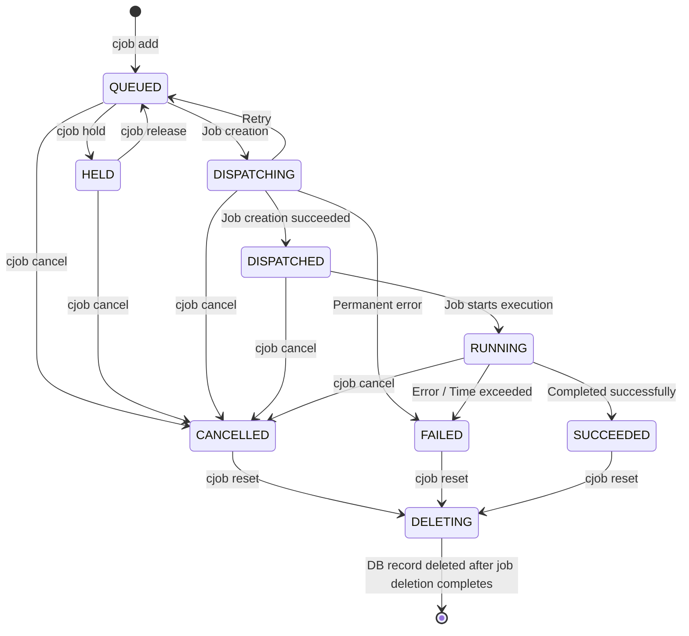

🇯🇵 [日本語](README.md)

> *This document was auto-translated from the [Japanese original](README.md) by Claude and may contain errors. Refer to the original for the authoritative content.*

<div style="text-align: center;" align="center">

# `cjob`

A Kubernetes Job Queue System for Research Computing

**Links:** [Examples](#examples)
— [Installation](#installation)
— [User Guide](./docs_en/user_guide.md)
— [Operations Manual](./docs_en/operations.md)
— [Deployment Guide](./docs_en/deployment.md)
— [System Architecture](./docs_en/system_architecture.md)

</div>

---

`cjob` is a distributed job management tool for research computing. It enables parallel processing by distributing computations across multiple compute nodes. Jobs are executed in the same environment as the one from which they were submitted. The home directory is also shared, making it easy to save numerical data through file output. It is designed for shared compute node environments used by research groups or departments (up to approximately 100 concurrent active users).

---

## Features

### Simple Usability

📦 **Easy Job Submission** — Submit a job with just `cjob add -- python main.py`

🔄 **Seamless Environment Reproduction** — Working directory, environment variables, and virtual environments are carried over to the job execution environment as-is

⏱️ **Execution Time Control** — Per-job time limits prevent unexpected long-running jobs from monopolizing resources

📊 **Resource Usage Visualization** — Check daily CPU and memory consumption for the past 7 days with `cjob usage`

### Robust Cluster Operations

☸️ **Kubernetes Native** — Efficient resource management via Kueue with high fault tolerance through auto-healing

🔧 **Flexible Cluster Scaling** — Automatically detects addition and removal of compute nodes; scale out with a single command

🔀 **Multi-Flavor Support** — ResourceFlavor enables appropriate job routing to different compute resources such as CPU nodes and GPU nodes

⚖️ **Fair Resource Allocation** — Dominant Resource Fairness-based scheduling ensures fair resource distribution among users

🧩 **Gap Filling** — Even when jobs are stalled, smaller jobs that fit available resources are automatically filled into gaps

🔒 **Secure Multi-User Environment** — User isolation via namespaces and Kubernetes standard authentication mechanisms

## Examples

### Submitting a Single Job

```bash
$ cjob add -- python main.py --alpha 0.1 --beta 42
```

- Submits a job to the job management system
- You can pass the execution command directly to `cjob add`

### Parameter Sweep

```bash
# Execute 100 tasks with parallelism of 10 (_INDEX_ is replaced with 0-99)
$ cjob sweep -n 100 --parallel 10 -- python main.py --trial _INDEX_
```

- Repeatedly executes the same command with different index values
- `_INDEX_` is replaced with integers assigned sequentially starting from 0 for each task
- Within script files, you can reference it via the `$CJOB_INDEX` environment variable
- For details, see [Efficient Job Execution with sweep](./docs_en/user_guide.md#2-efficient-job-execution-with-sweep) in the User Guide

### Executing Commands and Shell Scripts

```bash
$ cjob add -- echo "Hello World!"
```

- You can submit programs other than Python as well

### Execution with Virtual Environments

```bash
# When activating a virtual environment
$ source .venv/bin/activate
$ cjob add -- python main.py

# When using a virtual environment tool (e.g., uv)
$ uv run -- cjob add -- python main.py
```

- Virtual environment settings can be carried over to jobs
- Working directory and environment variables (such as `PATH`) are reproduced in the job execution environment

### Resource Specification

```bash
# Specify CPU and memory
$ cjob add --cpu 10 --memory 16Gi -- python main.py

# Specify execution time limit
$ cjob add --time-limit 1h -- python main.py
```

- You can specify the number of CPU cores (`--cpu`) and amount of memory (`--memory`) for the job. Set these according to the actual resource usage of your program
- Time limits can be specified in seconds (`600`: 10 minutes) or common notations (`1h`: 1 hour, `1d`: 1 day, etc.)
- When the time limit is reached, the job is forcibly terminated
- The default time limit is 1 day
- Remaining time until the time limit for each job can be checked with `cjob status`
- The time limit is **a type of resource**. Overuse will lower job execution priority, so please be aware
  - Once a job enters the RUNNING state, the time limit resource is consumed; it is not refunded even if the job is subsequently cancelled or fails
  - Even if actual computation time is shorter than the time limit, the full `--time-limit` value is consumed. Estimate your program's computation time and set an appropriate value
- For details on job count limits, see [Job Count Limits](./docs_en/user_guide.md#1-job-count-limits) in the User Guide
- For details on resource specification, see [CPU Core Count Guide](./docs_en/user_guide.md#6-aligning-cpu-core-count-between-your-program-and---cpu) in the User Guide

### Specifying Compute Resource Type (Flavor)

```bash
# Run on GPU nodes
$ cjob add --flavor gpu --gpu 1 -- python train.py
```

- `--flavor` specifies the type of compute resource for the job. It allows you to use different types of nodes such as CPU nodes and GPU nodes
- If `--flavor` is omitted, the default type is selected
- Available types can be checked with `cjob flavor list`
- For details, see [Specifying Compute Resource Type](./docs_en/user_guide.md#3-specifying-compute-resource-type---flavor) in the User Guide

### Checking Resource Usage

```bash
$ cjob usage
```

- Check current consumption and allocation limits for CPU, memory, GPU, and job count
- Displays daily resource consumption for the past 7 days
- For details, see [Checking Resource Usage](./docs_en/user_guide.md#7-checking-resource-usage-cjob-usage) in the User Guide

### Listing Jobs

```bash
# Display up to 50 jobs
$ cjob list

# Display jobs with a specific status
$ cjob list --status RUNNING
```

- Displays a list of submitted jobs
- You can check job IDs, job status, computation start time, etc.
- For available statuses, see [Job States](#job-states)

### Checking Status

```bash
$ cjob status <job-id>
```

- Displays the status of a specific job
- Shows more detailed information than the list view

### Cancelling

```bash
$ cjob cancel <job-id>
```

- Cancels jobs that have not yet completed (before or at RUNNING)
- Job IDs can be specified as ranges (`1-5`), comma-separated (`1,3,5`), or combinations (`1-5,8,10-12`)

### Retrieving Logs

```bash
# Check after completion
$ cjob logs <job-id>

# Real-time tracking
$ cjob logs --follow <job-id>
```

- Displays the standard output of a job

> [!CAUTION]
> Standard output and standard error output are saved in the user's storage. Be aware that leaving large amounts of logs can consume significant storage space.

### Holding and Releasing Jobs

```bash
# Hold job execution
$ cjob hold <job-id>

# Release hold and return to queue
$ cjob release <job-id>
```

- You can temporarily hold execution of queued (QUEUED) jobs
- Held jobs are not selected by the Dispatcher and will not start execution
- Releasing a hold with `cjob release` allows the job to be executed like a normal queued job
- Like cancel, you can use range specification (`1-5`), comma-separated (`1,3,5`), and `--all`
- For details, see [Holding Job Execution](./docs_en/user_guide.md#4-holding-job-execution-cjob-hold--cjob-release) in the User Guide

### Modifying Parameters of Submitted Jobs

```bash
# Change flavor and resources of queued/held jobs
$ cjob set <job-ids> --flavor cpu-sub --cpu 4 --memory 16Gi --time-limit 12h
```

- Only the specified options are updated; unspecified items retain their current values
- For details, see [Modifying Parameters of Submitted Jobs](./docs_en/user_guide.md#5-modifying-parameters-of-submitted-jobs-cjob-set) in the User Guide

### Deleting Completed Jobs

```bash
# Specify a single job ID
$ cjob delete <job-id>

# Delete all completed jobs (running jobs are skipped)
$ cjob delete --all
```

- Removes job information from the job management system
- Like cancel, range and comma-separated specifications are supported
- Job log files are also deleted

### Reset

```bash
$ cjob reset
```

- Resets to a state with no jobs
- Clears all completed and cancelled jobs
- Returns an error if there are jobs in other states (e.g., RUNNING)

> [!CAUTION]
> The reset process takes a moment to complete. Please confirm that all jobs have been removed with `cjob list` before submitting new jobs.

### Displaying Help

```bash
$ cjob help
```

- The help command displays a brief description
- Subcommand help is also available (e.g., `cjob help add`)

## Installation

You can install the latest `cjob` with the following command:

```bash
curl -fsSL https://github.com/Shu-Tanaka-Group/research-cluster-job-system/releases/latest/download/cjob-linux-x86_64 -o /tmp/cjob
chmod u+x /tmp/cjob
mv /tmp/cjob ~/.local/bin/cjob
```

## Update

If you have `cjob` version 1.2.0 or later, you can update using the command:

```bash
cjob update
```

To display a list of available versions, use `--list`:

```bash
cjob update --list
```

To install a specific version, use `--version`:

```bash
cjob update --version 1.3.0
```

For earlier versions, please reinstall by running the installation commands again. Running the installation commands will install the latest version.

## Job States

Submitted jobs will be in one of the following states:



> [!NOTE]
> `cjob delete` immediately deletes completed jobs.
> `cjob reset` transitions all jobs to the DELETING state, safely removes cluster resources, and then deletes the jobs. The job ID counter is also reset to 1.

| Status          | Description                                          |
| --------------- | ---------------------------------------------------- |
| **QUEUED**      | Submitted, waiting for Dispatcher selection          |
| **HELD**        | Execution held by user (release with `cjob release`) |
| **DISPATCHING** | Dispatcher is creating the job                       |
| **DISPATCHED**  | Job created, waiting for resource allocation         |
| **RUNNING**     | Job is executing                                     |
| **SUCCEEDED**   | Completed successfully                               |
| **FAILED**      | Failed (error / time exceeded / retry limit)         |
| **CANCELLED**   | Cancelled by user                                    |
| **DELETING**    | Deletion in progress after `cjob reset`              |
