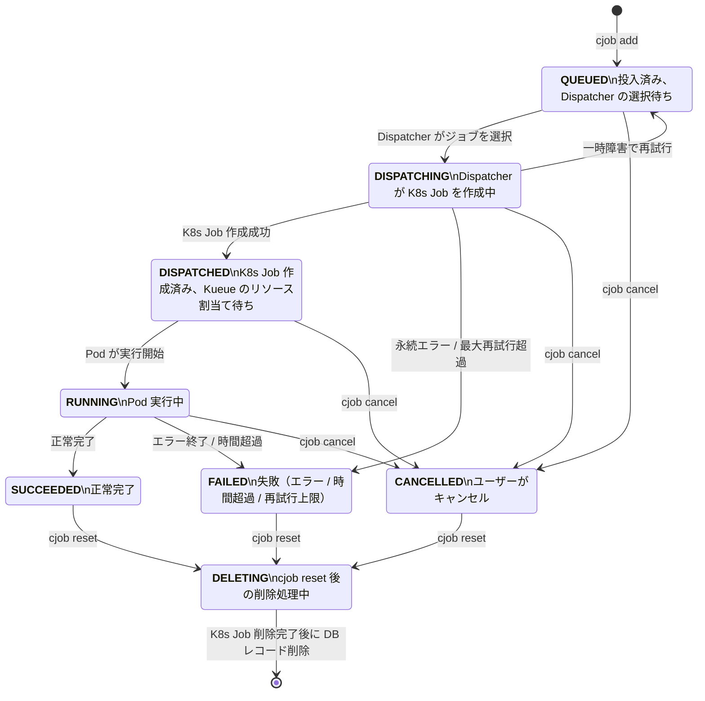

<div style="text-align: center;" align="center">

# `cjob`

研究室計算機クラスタ用のジョブキューシステム

**Links:** [使用例](#使用例)
    — [インストール方法](#インストール)
    — [開発用ドキュメント](./docs/)

</div>

---

`cjob` は研究室所有の計算機クラスタ用の分散ジョブ管理ツールです。複数の計算に計算を分散させた並列処理を実行できます。ジョブの実行はジョブを投入した環境と同じ環境で実行されます。またホームディレクトリも共有されるので、ファイル出力による数値計算データの生成などを簡単に実現できます。

---

## 使用例

### 単一ジョブの投入

```bash
$ cjob add -- python main.py --alpha 0.1 --beta 42
```

- ジョブ管理システムにジョブを投入します
- 実行コマンドをそのまま `cjob add` に渡すことができます

### コマンド・シェルスクリプトの実行

```bash
$ cjob add -- echo "Hello World!"
```

- Python以外のプログラムも投入できます

### 仮想環境を利用した実行

```bash
# 仮想環境を有効化する場合
$ source .venv/bin/activate
$ cjob add -- python main.py

# 仮想環境ツールを使用する場合（例： uv）
$ uv run -- cjob add -- python main.py
```

- 仮想環境の設定をジョブに引き継がせることができます
- 作業ディレクトリや環境変数（`PATH`など）がジョブ実行環境に再現されます


### リソース指定

```bash
# CPUとメモリを指定
$ cjob --cpu 10 --memory 16Gi -- python main.py

# 実行時間の上限を指定
$ cjob --time-limit 1h -- python main.py
```

- ユーザーが使用可能なリソースを超える要求をした場合は、ジョブがRUNNING状態になりません
- 実行時間の上限は秒数指定（`600`: 10分）や一般的な表記方法（`1h`: 1時間、`1d`: 1日など）が使用できます
- 実行時間の上限に達するとジョブが強制的に停止させられます
- デフォルトの実行時間の上限は今のところ1日です
- 各ジョブの実行時間の上限までの残り時間は `cjob status` で確認できます
- 実行時間の上限は**リソースの一種**です。使いすぎるとジョブ実行の優先度が低下するので注意してください
    - 一度RUNNING状態になると実行時間の上限リソースが消費され、その後キャンセルやエラーとなっても返却されません
    - 計算時間が計算時間の上限より短かったとしても、`--time-limit` で指定された計算時間の上限が消費されます。実行プログラムの計算時間を見積り、適切な値を設定してください


### ジョブ一覧表示

```bash
# 最大50件を表示する
$ cjob list

# 特定状態のジョブを表示する
$ cjob list --status RUNNING
```

- 投入したジョブのリストを表示します
- ジョブのIDやジョブの状態、計算開始時刻などを確認できます
- 指定可能な状態は[ジョブの状態](#ジョブの状態)を参照してください


### 状態確認

```bash
$ cjob status <job-id>
```

- 特定のジョブの状態を表示します
- リスト表示よりも詳細な情報が表示されます

### キャンセル

```bash
$ cjob cancel <job-id>
```

- 完了前（SUCCEEDEDやFAILED以外）のジョブをキャンセルします
- キャンセルするジョブIDは、範囲指定（`1-5`）や複数指定（`1,3,5`）、それらの組み合わせ指定（`1-5,8,10-12`）で選択します

### ログ取得

```bash
# 完了後に確認
$ cjob logs <job-id>

# リアルタイム追跡
$ cjob logs --follow <job-id>
```

- ジョブの標準出力を表示します

> :caution: 標準出力と標準エラー出力はユーザーのストレージ内に保存されます。大量のログを残しておくとストレージ圧迫の原因となりえるので注意してください。

### 完了済みジョブの削除


```bash
# 単体ジョブID指定
$ cjob delete <job-id>

# 完了済みジョブを全て削除（実行中ジョブはスキップ）
$ cjob delete --all
```

- ジョブの情報をジョブ管理システムから消去します
- キャンセルと同様に範囲指定や複数指定が可能です
- ジョブのログファイルも削除されます


### リセット

```bash
$ cjob reset
```

- ジョブが全くない状態にリセットします
- 終了したジョブやキャンセルしたジョブを全て消去します
- それ以外の状態（RUNNING状態など）のジョブがあるときにはエラーとなります

> :caution: リセットが完了するまでには少し時間がかかります。`cjob list` で全てのジョブがきたことを確認してから新しいジョブを投入してください。


### ヘルプ表示

```bash
$ cjob help
```

- ヘルプコマンドで簡単な説明を表示できます
- サブコマンドのヘルプも表示できます（例：`cjob help add`）


## インストール

`gh` コマンドが使えるなら次の一連のコマンドで `cjob` をインストールできます。

```bash
gh release download --repo Shu-Tanaka-Group/stg-cluster-job-system --pattern "cjob" -D /tmp
chmod u+x /tmp/cjob
mv /tmp/cjob ~/.local/bin/cjob
```

手動で `cjob` ファイルをアップロードする場合は、アップロードしたファイルのパスに対して、実行権限の付与（`chmod u+x <cjob file>`）と実行パス上への配置（`mv <cjob file> ~/.local/bin/`）を行ってください。


## ジョブの状態

投入されたジョブは以下の状態のいずれかとなります。



