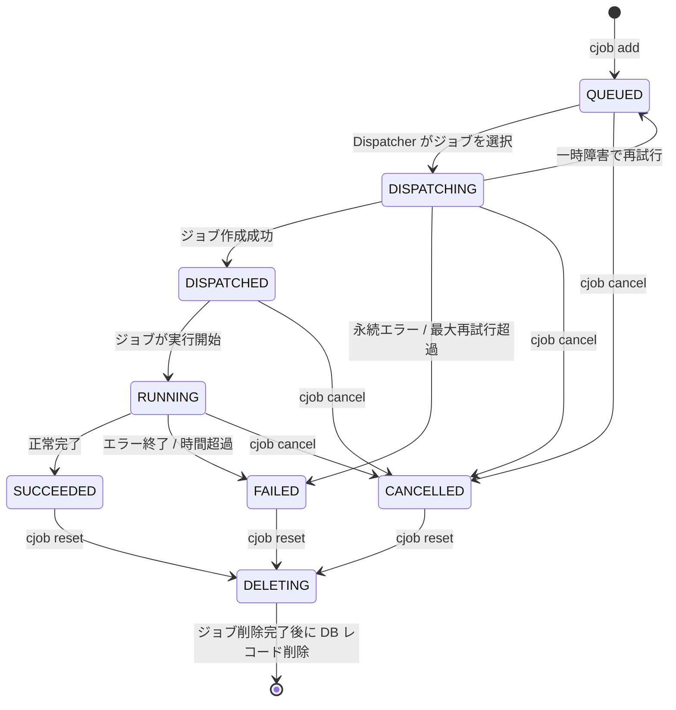

<div style="text-align: center;" align="center">

# `cjob`

研究計算のための Kubernetes ジョブキューシステム

**Links:** [使用例](#使用例)
    — [インストール方法](#インストール)
    — [ユーザーガイド](./docs/user_guide.md)
    — [運用マニュアル](./docs/operations.md)
    — [システム構築手順](./docs/deployment.md)
    — [システム設計](./docs/system_architecture.md)

</div>

---

`cjob` は研究計算のための分散ジョブ管理ツールです。複数の計算機に計算を分散させた並列処理を実行できます。ジョブの実行はジョブを投入した環境と同じ環境で実行されます。またホームディレクトリも共有されるので、ファイル出力による数値計算データの保存などを簡単に実現できます。研究グループや部門（同時アクティブユーザー数 100 名程度まで）で共有する計算ノードの計算環境を想定しています。

---

## 特徴

### ユーザー向け

📦 **シンプルなジョブ投入** — `cjob add -- python main.py` だけでジョブを投入

🔄 **シームレスな環境再現** — 作業ディレクトリ・環境変数・仮想環境をジョブ実行環境にそのまま引き継ぎ

⏱️ **実行時間制御** — ジョブごとの時間上限設定で、想定外の長時間ジョブによるリソース占有を防止

📊 **リソース消費の可視化** — `cjob usage` で直近 7 日間の CPU・メモリ消費量を日別に確認

### クラスタ管理

☸️ **Kubernetes ネイティブ** — Kueue による効率的なリソース管理と、オートヒーリングによる高い耐障害性

🔧 **柔軟なクラスタ拡張** — 計算ノードの追加・撤去を自動検知し、コマンド1つでスケールアウト

🔀 **マルチフレーバー対応** — ResourceFlavor により CPU ノードと GPU ノードなど、異なる計算資源にジョブを適切に振り分け

⚖️ **公平なリソース分配** — Dominant Resource Fairness ベースのスケジューリングで、ユーザー間のリソースを公平に分配

🧩 **Gap Filling** — 滞留ジョブがあっても、空きリソースに収まる小さなジョブを自動で隙間充填

🔒 **安全なマルチユーザー環境** — namespace によるユーザー分離と Kubernetes 標準の認証機構

## 使用例

### 単一ジョブの投入

```bash
$ cjob add -- python main.py --alpha 0.1 --beta 42
```

- ジョブ管理システムにジョブを投入します
- 実行コマンドをそのまま `cjob add` に渡すことができます

### パラメータスイープ

```bash
# 100 タスクを並列 10 で実行（_INDEX_ が 0〜99 に置換される）
$ cjob sweep -n 100 --parallel 10 -- python main.py --trial _INDEX_
```

- 同じコマンドを異なるインデックス値で繰り返し実行します
- `_INDEX_` は各タスクに 0 から順に割り当てられる整数に置換されます
- スクリプトファイル内では `$CJOB_INDEX` 環境変数で参照できます

### コマンド・シェルスクリプトの実行

```bash
$ cjob add -- echo "Hello World!"
```

- Python以外のプログラムも投入できます

### 仮想環境を利用した実行

```bash
# 仮想環境を有効化する場合
$ source .venv/bin/activate
$ cjob add -- python main.py

# 仮想環境ツールを使用する場合（例： uv）
$ uv run -- cjob add -- python main.py
```

- 仮想環境の設定をジョブに引き継がせることができます
- 作業ディレクトリや環境変数（`PATH`など）がジョブ実行環境に再現されます

### リソース指定

```bash
# CPUとメモリを指定
$ cjob --cpu 10 --memory 16Gi -- python main.py

# 実行時間の上限を指定
$ cjob --time-limit 1h -- python main.py
```

- ユーザーが使用可能なリソースを超える要求をした場合は、ジョブがRUNNING状態になりません
- 実行時間の上限は秒数指定（`600`: 10分）や一般的な表記方法（`1h`: 1時間、`1d`: 1日など）が使用できます
- 実行時間の上限に達するとジョブが強制的に停止させられます
- デフォルトの実行時間の上限は今のところ1日です
- 各ジョブの実行時間の上限までの残り時間は `cjob status` で確認できます
- 実行時間の上限は**リソースの一種**です。使いすぎるとジョブ実行の優先度が低下するので注意してください
  - 一度RUNNING状態になると実行時間の上限リソースが消費され、その後キャンセルやエラーとなっても返却されません
  - 計算時間が計算時間の上限より短かったとしても、`--time-limit` で指定された計算時間の上限が消費されます。実行プログラムの計算時間を見積り、適切な値を設定してください
- ジョブ数の上限についての詳細は[ユーザーガイド](./docs/user_guide.md)をご参照ください

### リソース使用状況の確認

```bash
$ cjob usage
```

- 直近 7 日間の日別リソース消費量を表示します
- CPU は core·h（コア時間）、メモリは GiB·h（ギビバイト時間）の単位で表示されます
- リソース消費量はジョブが RUNNING になった時点で `--time-limit` の値をもとに計上されます

### ジョブ一覧表示

```bash
# 最大50件を表示する
$ cjob list

# 特定状態のジョブを表示する
$ cjob list --status RUNNING
```

- 投入したジョブのリストを表示します
- ジョブのIDやジョブの状態、計算開始時刻などを確認できます
- 指定可能な状態は[ジョブの状態](#ジョブの状態)を参照してください

### 状態確認

```bash
$ cjob status <job-id>
```

- 特定のジョブの状態を表示します
- リスト表示よりも詳細な情報が表示されます

### キャンセル

```bash
$ cjob cancel <job-id>
```

- 終了前（RUNNING以前）のジョブをキャンセルします
- キャンセルするジョブIDは、範囲指定（`1-5`）や複数指定（`1,3,5`）、それらの組み合わせ指定（`1-5,8,10-12`）で選択します

### ログ取得

```bash
# 完了後に確認
$ cjob logs <job-id>

# リアルタイム追跡
$ cjob logs --follow <job-id>
```

- ジョブの標準出力を表示します

> [!CAUTION]
> 標準出力と標準エラー出力はユーザーのストレージ内に保存されます。大量のログを残しておくとストレージを圧迫することがあるので注意してください。

### 完了済みジョブの削除

```bash
# 単体ジョブID指定
$ cjob delete <job-id>

# 完了済みジョブを全て削除（実行中ジョブはスキップ）
$ cjob delete --all
```

- ジョブの情報をジョブ管理システムから消去します
- キャンセルと同様に範囲指定や複数指定が可能です
- ジョブのログファイルも削除されます

### リセット

```bash
$ cjob reset
```

- ジョブが全くない状態にリセットします
- 終了したジョブやキャンセルしたジョブを全て消去します
- それ以外の状態（RUNNING状態など）のジョブがあるときにはエラーとなります

> [!CAUTION]
> リセットが完了するまでには少し時間がかかります。`cjob list` で全てのジョブが消えたことを確認してから新しいジョブを投入してください。

### ヘルプ表示

```bash
$ cjob help
```

- ヘルプコマンドで簡単な説明を表示できます
- サブコマンドのヘルプも表示できます（例：`cjob help add`）

## インストール

`gh` コマンドが使えるなら次の一連のコマンドで `cjob` をインストールできます。

```bash
gh release download --repo Shu-Tanaka-Group/stg-cluster-job-system --pattern "cjob" -D /tmp
chmod u+x /tmp/cjob
mv /tmp/cjob ~/.local/bin/cjob
```

手動で `cjob` ファイルをインストールする場合は、[リリースページ](https://github.com/Shu-Tanaka-Group/stg-cluster-job-system/releases)から最新の `cjob` ファイルをダウンロードしてください。
計算環境に `cjob` をアップロードしたら、実行権限の付与（`chmod u+x <cjob file>`）と実行パス上への配置（`mv <cjob file> ~/.local/bin/`）を行ってください。

## アップデート

バージョン1.2.0以降の `cjob` コマンドであれば、コマンドでアップデート可能です。

```bash
cjob update
```

インストール可能なバージョンの一覧を表示するには `--list` を使用します。

```bash
cjob update --list
```

特定のバージョンを指定してインストールするには `--version` を使用します。

```bash
cjob update --version 1.3.0
```

それ以前のコマンドのアップデートは再インストールで対応してください。一連のインストールコマンドを実行すれば、最新バージョンが再インストールされます。

## ジョブの状態

投入されたジョブは以下の状態のいずれかとなります。



> [!NOTE]
> `cjob delete` は完了済みジョブを即座に削除します。
> `cjob reset` は全ジョブを DELETING 状態に移行し、クラスタ上のリソースを安全に削除した後にジョブを削除します。ジョブ ID カウンターも 1 にリセットされます。

| ステータス      | 説明                                         |
| --------------- | -------------------------------------------- |
| **QUEUED**      | 投入済み、Dispatcher の選択待ち              |
| **DISPATCHING** | Dispatcher がジョブを作成中                  |
| **DISPATCHED**  | ジョブ作成済み、実行リソース割当て待ち       |
| **RUNNING**     | ジョブ実行中                                 |
| **SUCCEEDED**   | 正常完了                                     |
| **FAILED**      | 失敗（エラー / 時間超過 / 再試行上限）       |
| **CANCELLED**   | ユーザーがキャンセル                         |
| **DELETING**    | `cjob reset` 後の削除処理中                  |
